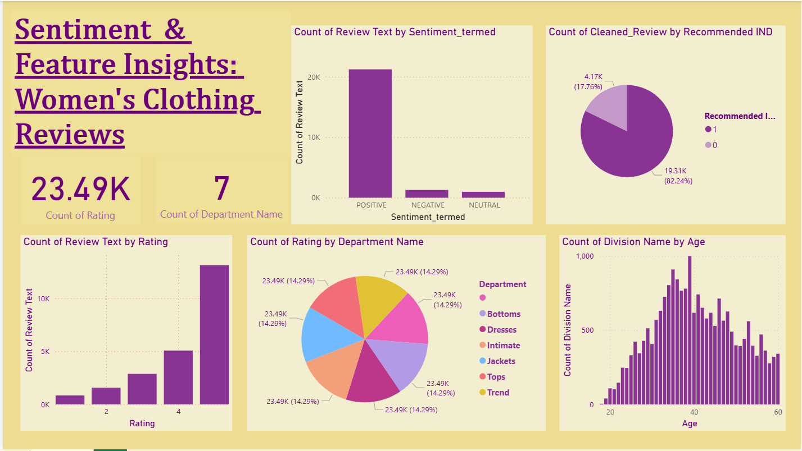

# 👗 Women's Clothing Reviews: Sentiment & Feature Insights
This is my very First Dashboard, which I built using Power BI as a part of my Internal Assessment of AI in E-Commerce Course.
It comprehensive Power BI dashboard analyzing customer reviews and sentiments in women's clothing.

## Purpose
This dashboard provides a detailed visual analysis of women's clothing reviews, exploring sentiment distribution, rating patterns, department breakdowns, and customer demographics across different product categories.

## Tech Stack
• 📊 Power BI Desktop – Primary data visualization platform
• 📁 File Format – .pbix for dashboard development

## Data Source
Dataset covering women's clothing reviews, including sentiment analysis, ratings, department classifications, and customer age information.

## Features & Highlights

### Dashboard Capabilities
• Sentiment analysis of review texts
• Breakdown of ratings by department
• Distribution of reviews across different clothing categories
• Age distribution of reviewers
• Recommendation insights

### Key Insights
• Total ratings analyzed: 23.49K
• Number of departments: 7
• Sentiment distribution:
  - Predominantly positive reviews
  - Minimal negative feedback
• Department coverage:
  - Bottoms
  - Dresses
  - Intimate
  - Jackets
  - Tops
  - Trend

### Visualizations
• Sentiment distribution chart
• Review text count by rating
• Department name distribution
• Recommended index pie chart
• Age distribution histogram

## Screenshots

## Project Hashtags
#DataVisualization #PowerBI #CustomerInsights #FashionAnalytics #SentimentAnalysis
